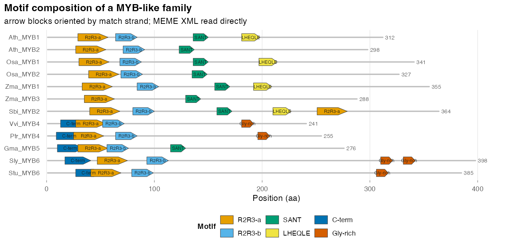
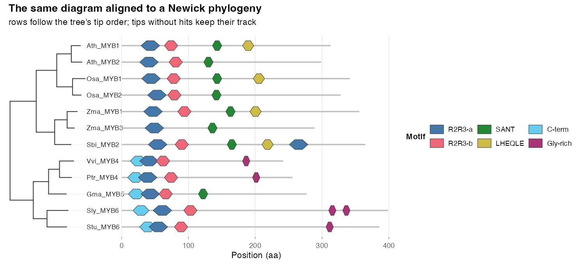
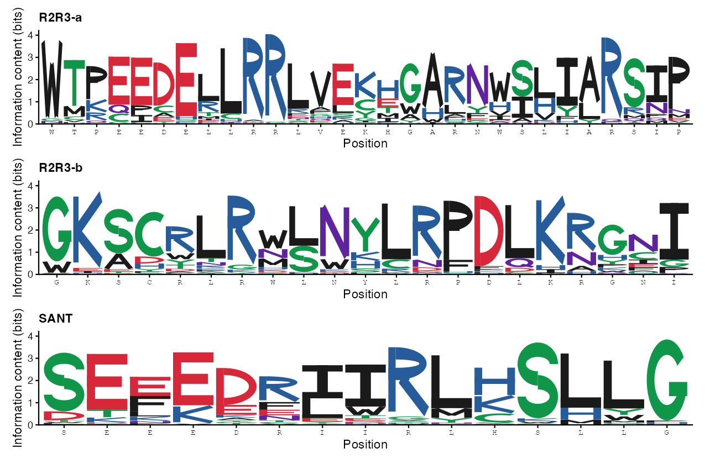
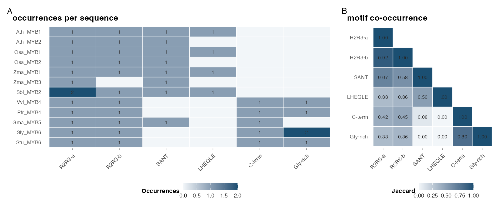
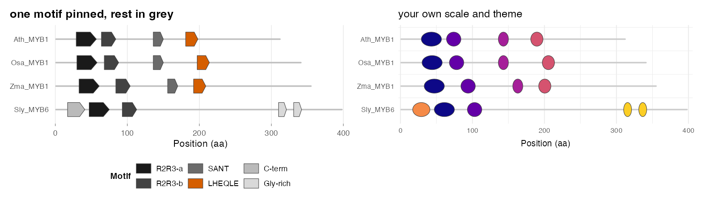
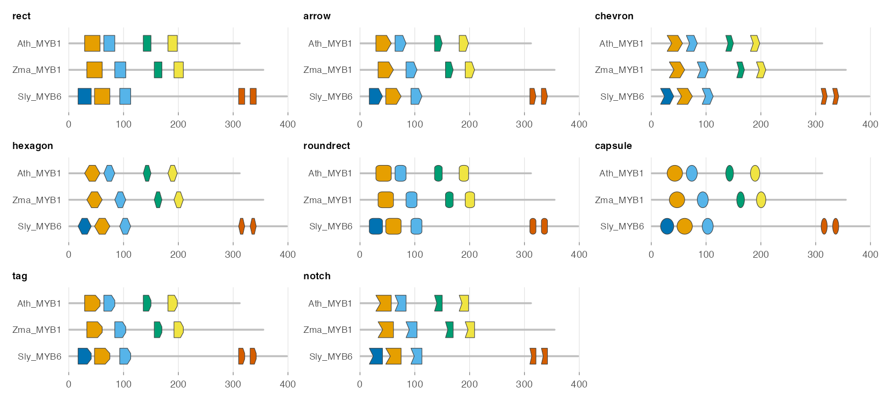

# memeplotr

<!-- badges: start -->
[](https://github.com/YOURNAME/memeplotr/actions/workflows/R-CMD-check.yaml)
<!-- badges: end -->

Publication-ready motif figures from MEME Suite output, built with ggplot2.

MEME Suite writes its own HTML and EPS. The block diagram and the logos come
out with fixed colours, fixed block shapes, sequences in discovery order, and
no way to put the diagram next to a phylogeny. `memeplotr` reads `meme.xml`
instead and returns tidy data frames and ordinary `ggplot2` objects, so colour,
shape, order, labelling and composition are all under your control - and the
figure can be regenerated from a script.

## Install

```r
# install.packages("remotes")
remotes::install_github("YOURNAME/memeplotr", build_vignettes = TRUE)
```

Or from a local source tarball:

```r
remotes::install_local("memeplotr_0.1.4.tar.gz", build_vignettes = TRUE)
```

Required: `ggplot2`, `xml2`, `dplyr`, `rlang`, `scales`, `patchwork`, `ape`.
The Shiny app additionally needs `shiny`, `bslib` and `svglite`.

## Quick start

```r
library(memeplotr)

res <- read_meme("meme.xml")                  # tidy tables + PWMs
res <- relabel_motifs(res, "consensus")       # rename motifs everywhere at once

gg_motif_map(res)                             # the block diagram
gg_tree_motifs(res, "species.nwk")            # the same diagram beside a tree
gg_motif_logo(res, 1)                         # a sequence logo from the PWM
run_memeplotr()                               # point-and-click front end
```

### Motif composition diagram

```r
gg_motif_map(res, label = TRUE, length_label = TRUE,
             title = "Motif composition of a MYB-like family")
```



### Aligned to a phylogeny

The part MEME cannot do: a Newick tree drawn in pure ggplot2 with the motif
map on exactly the same rows. Tips with no hits keep their track, so nothing
slips out of register.

```r
gg_tree_motifs(res, "species.nwk", align_tips = TRUE, widths = c(1, 2.6),
               shape = "hexagon", palette = "bright")
```



### Sequence logos

Letters are polygons, not glyphs from a font - so they respond to `fill`,
`colour`, `alpha` and themes like any other layer, and they render identically
on every graphics device.

```r
gg_motif_logos(res, motifs = c("R2R3-a", "R2R3-b", "SANT"), ncol = 1,
               show_consensus = TRUE)
```



### Summary and comparative views

```r
gg_motif_heatmap(res, order = "tree", tree = "species.nwk", keep_empty = TRUE,
                 value = "count", label = TRUE)
gg_motif_cooccurrence(res, measure = "jaccard", label = TRUE)
```



### Colour and shape are yours

Pin one motif to a colour against a neutral palette, or throw the package
scale away and use your own:

```r
gg_motif_map(res, colours = c("LHEQLE" = "#D55E00"), palette = "grey")

gg_motif_map(res, shape = "capsule") +
  scale_fill_viridis_d(option = "plasma", end = 0.9) +
  theme_minimal()
```



Nine block shapes are built in (`motif_shapes()`):



## Function reference

| Reading | |
|---|---|
| `read_meme()` | `meme.xml` / `streme.xml` / `dreme.xml` → tidy `meme_result` |
| `read_fimo()` | FIMO TSV or GFF |
| `as_motif_table()` | adapt any data frame of motif coordinates |
| `read_tree()` | Newick file, string or `phylo` object |
| `relabel_motifs()` | rename motifs across every table at once |
| **Plotting** | |
| `gg_motif_map()` | block diagram: shape, palette, order, filters, labels |
| `gg_motif_logo()`, `gg_motif_logos()` | sequence logos from the PWMs |
| `gg_phylo()` | rectangular tree / cladogram in pure ggplot2 |
| `gg_tree_motifs()`, `gg_tree_panel()` | tree-aligned composites |
| `gg_motif_heatmap()` | sequence × motif presence or counts |
| `gg_motif_counts()` | stacked occurrence bars |
| `gg_motif_cooccurrence()` | Jaccard / count co-occurrence matrix |
| `gg_motif_positions()` | positional distribution per motif |
| **Building blocks** | |
| `geom_motif()`, `stat_motif()` | the block layer, for plots you build yourself |
| `scale_fill_motif()`, `motif_palette()`, `memeplotr_palettes()` | palettes |
| `letter_outline()`, `logo_heights()`, `logo_colours()` | logo internals |
| `theme_motif()`, `theme_tree_motif()` | themes |
| `tree_tip_order()` | tip order, for aligning plots of your own |
| `run_memeplotr()` | Shiny app |

## The Shiny app

`run_memeplotr()` gives a sidebar-driven front end over the same functions:
upload `meme.xml` and an optional Newick file, switch between the motif map,
tree composite, logos, heatmap, counts, co-occurrence and position views,
adjust palette, shape, order and filters, then download PNG / PDF / SVG. The
**R code** tab prints the `ggplot2` call that produced what you are looking at,
so an exploratory session ends with reproducible code.

### Putting it on shinyapps.io

`memeplotr` is not on CRAN, so `rsconnect` cannot resolve `library(memeplotr)`
against a repository. Install the package *from GitHub* and it can: the
install records `RemoteType: github` in the package's DESCRIPTION, and
`rsconnect` passes that through so the server installs from the same repo.

```r
remotes::install_github("YOURNAME/memeplotr")   # not install_local()
packageDescription("memeplotr")$RemoteType      # must print "github"

shiny::runApp("deploy")                          # check locally first
rsconnect::setAccountInfo(name = "<account>", token = "<token>",
                          secret = "<secret>")   # once, from shinyapps.io
rsconnect::deployApp("deploy", appName = "memeplotr")
```

The URL is `https://<account>.shinyapps.io/memeplotr/`. The repository must be
public, or the server needs a `GITHUB_PAT`. Push your changes and reinstall
from GitHub before redeploying, or the server will install the older commit.

If you would rather not depend on GitHub at deploy time,
`bundle_shiny_app()` writes a directory that carries the package source
with it and loads it at startup with `pkgload::load_all()`, so the server only
installs CRAN packages:

```r
memeplotr::bundle_shiny_app("memeplotr-shinyapp")
rsconnect::deployApp("memeplotr-shinyapp", appName = "memeplotr")
```

## Data from other tools

Any table of "motif *m* occurs in sequence *s* from *start* to *stop*" works:

```r
tbl <- as_motif_table(hits, sequence = "gene", motif = "domain",
                      start = "from", stop = "to", seq_length = "len")
gg_motif_map(tbl)
```

## Vignette

```r
vignette("memeplotr")
```

## Licence

MIT.
